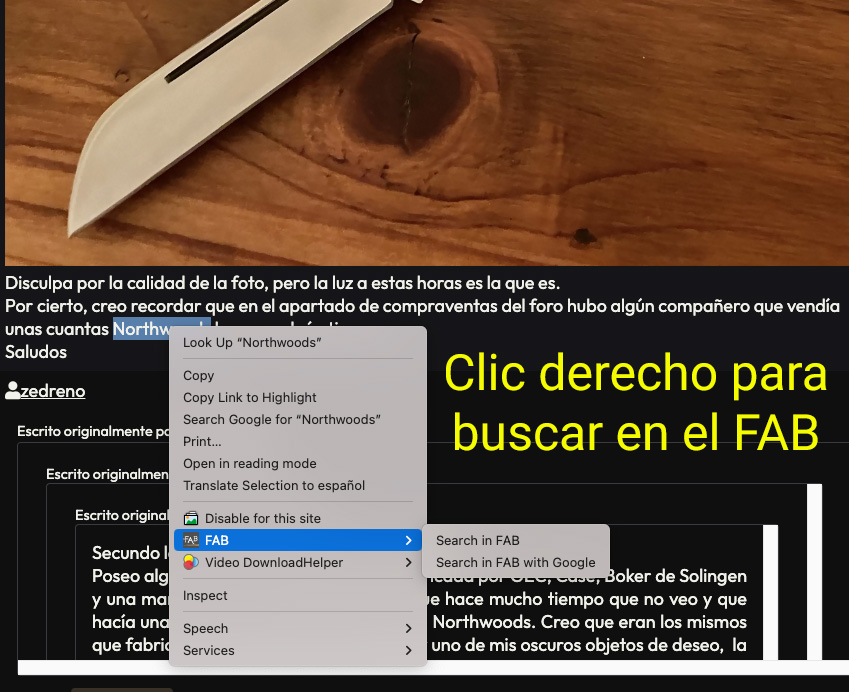
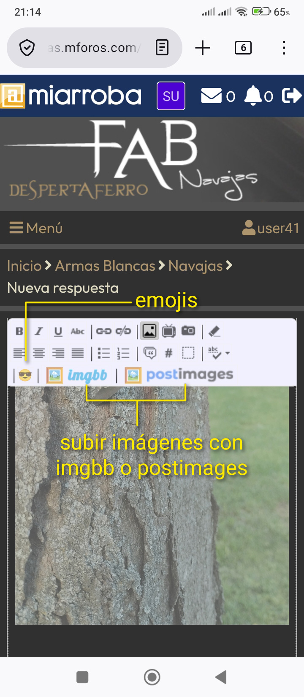
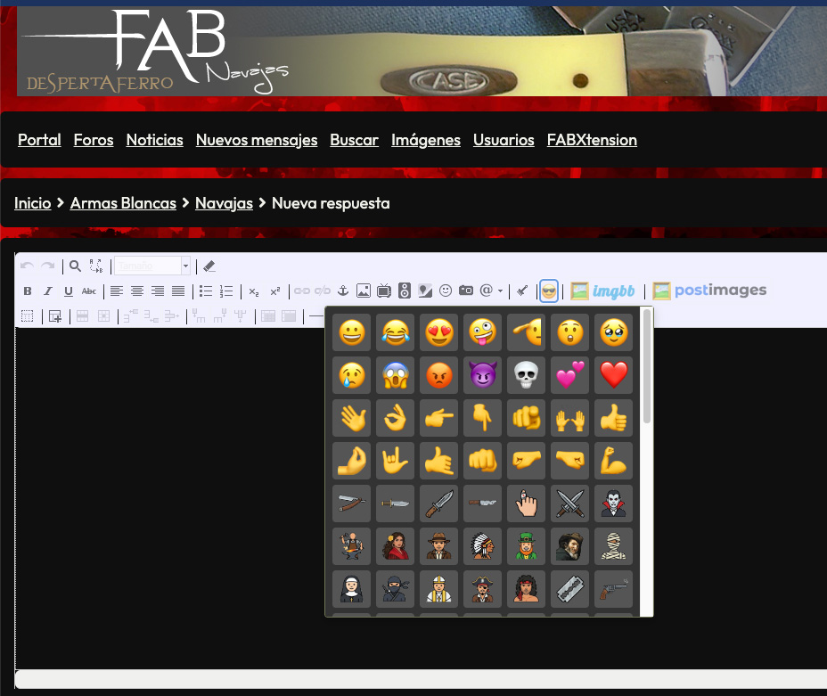
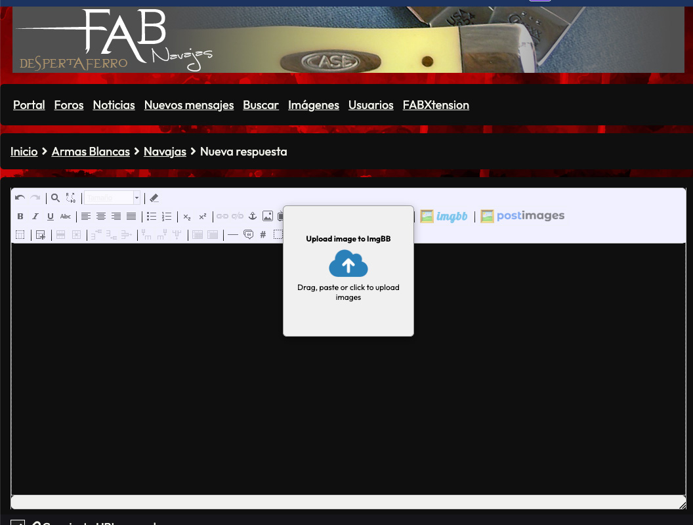
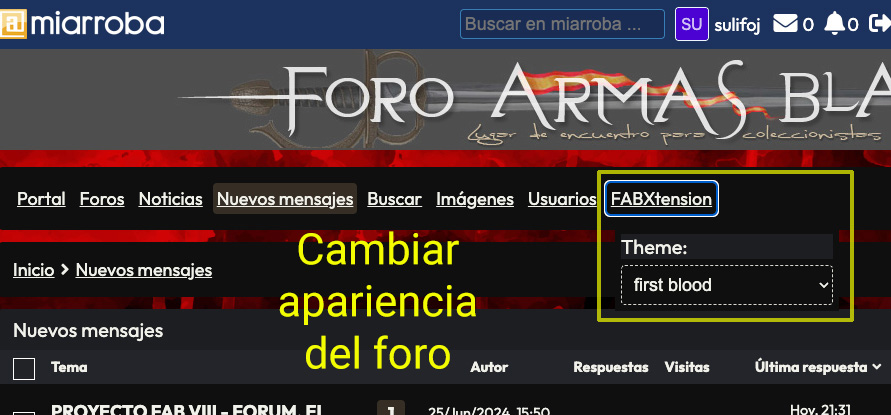
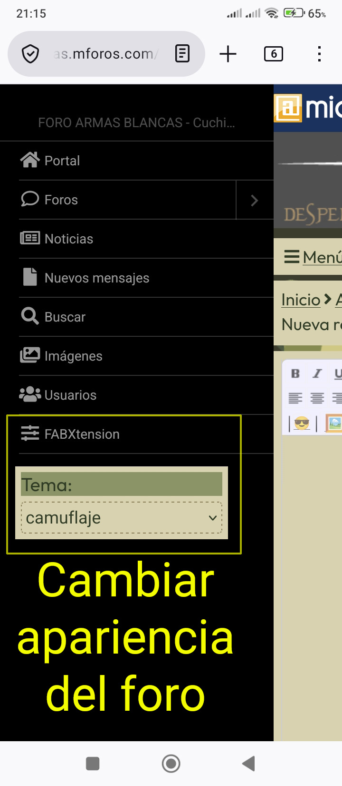
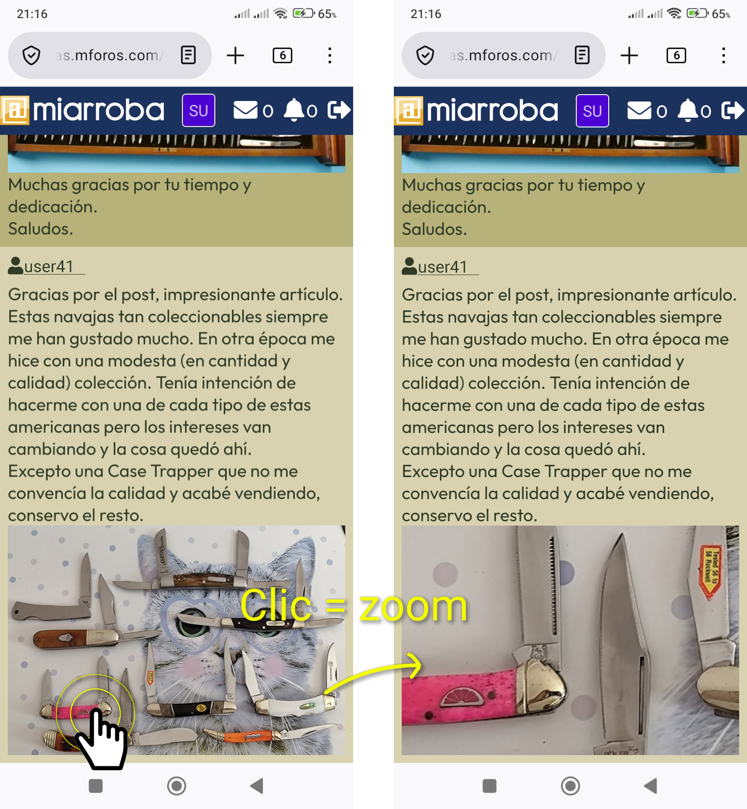

# FABXTension

FABXTension es una extensión para mejorar la experiencia en el Foro de Armas Blancas, alojado en Miarroba. El proyecto añade utilidades pensadas para el uso diario del foro, sobre todo en la edición de mensajes y en la lectura, con una base sencilla de mantener y ampliar.

Actualmente el código del repositorio está orientado a navegadores Chromium. Firefox y otros navegadores compatibles con WebExtensions forman parte del objetivo del proyecto, pero su compatibilidad no debe darse por cerrada hasta adaptar y validar esa variante.

## Qué aporta hoy

- Kit de emojis personalizados integrado en el editor de mensajes.
- Subida directa de imágenes desde el editor con dos proveedores (`ImgBB` y `Postimages`) mediante arrastrar, pegar o clic.
- Sistema de temas para cambiar el aspecto visual del foro (menú FABXtension).
- Zoom interactivo sobre imágenes en mensajes.
- Búsqueda contextual del texto seleccionado en el foro (búsqueda interna FAB y búsqueda en Google restringida al FAB).
- Botón para compartir hilos en redes sociales.
- Persistencia local de la preferencia de tema.
- Arquitectura simple en JavaScript sin proceso de build.

## Alcance del proyecto

FABXTension está pensado específicamente para el entorno del FAB en `armasblancas.mforos.com`. El código filtra el dominio antes de activar sus módulos, de modo que la extensión no pretende actuar como personalizador genérico de cualquier instalación de Miarroba.

## Estado actual

- Soporte verificado en Chromium mediante Manifest V3.
- Inyección de lógica desde `main.js` y trabajo de fondo desde `events.js`.
- Tema disponible en este momento: `marfil`, además del modo por defecto del foro.
- Catálogo de emojis definido en JSON y servido mediante URLs públicas del repositorio.

## Instalación manual en Chromium

1. Clona o descarga este repositorio.
2. Abre `chrome://extensions/` en Chrome, Brave, Edge o un navegador Chromium equivalente.
3. Activa el modo de desarrollador.
4. Pulsa en `Cargar descomprimida`.
5. Selecciona la carpeta `FABXTension/` que contiene `manifest.json`, no la raíz completa del repositorio.
6. Abre una página del foro y recárgala si ya la tenías abierta.

## Uso

### Emojis en el editor

Cuando entras en la pantalla de publicación o respuesta del foro, la extensión detecta la barra de TinyMCE y añade un botón propio con acceso al kit ampliado de emojis. Al pulsar sobre uno de ellos, inserta directamente la imagen en el editor.

### Subida de imágenes en el editor

En la misma barra de TinyMCE se añaden dos botones nuevos, justo detrás del botón de emojis:

1. `🖼️` + icono de `ImgBB`
2. `🖼️` + icono de `Postimages`

Al pulsar cualquiera se abre una ventana de subida de `200x200` que permite:

- Arrastrar imágenes.
- Pegar desde portapapeles.
- Hacer clic para abrir el selector de archivos del sistema.

Cada imagen subida se inserta automáticamente en el mensaje como:

```html
<p></p>
```

### Temas

El cambio de tema se realiza desde el menú integrado en la interfaz del foro (desktop y menú hamburguesa en móvil). Se mantiene la preferencia en almacenamiento local y se reaplica al recargar páginas del FAB.

### Menú contextual de búsqueda

Si seleccionas texto en una página del FAB y haces clic derecho, aparecen acciones en el menú contextual para:

1. Buscar en el FAB.
2. Buscar en el FAB con Google (`site:armasblancas.mforos.com`).

La codificación de consulta se adapta al destino para maximizar compatibilidad de búsqueda.
Esta función está orientada a escritorio para no interferir con el menú contextual nativo en móvil.

### Zoom de imágenes

Las imágenes del foro que no estén envueltas en un enlace pueden ampliarse con clic izquierdo. El sistema calcula la escala real de la imagen, aplica el zoom desde el punto pulsado y permite volver al estado normal con otro clic.

## Capturas

### Menú FAB y búsqueda



### Editor TinyMCE



### Panel de emojis



### Subida de imágenes con ImgBB



### Temas en desktop



### Temas en móvil



### Zoom sobre imágenes



## Estructura del repositorio

```text
.
├── README.md
├── emojis/
└── FABXTension/
	├── manifest.json
	├── main.js
	├── events.js
	├── readme.txt
	├── _locales/
	│   ├── es/messages.json
	│   └── en/messages.json
	├── res/
	│   └── emojis.json
	└── themes/
		└── marfil.css
```

## Archivos clave

- `FABXTension/manifest.json`: definición de la extensión, permisos, recursos y punto de entrada.
- `FABXTension/main.js`: lógica principal inyectada en el foro, enrutado por URL, editor de mensajes y zoom de imágenes.
- `FABXTension/events.js`: service worker con menú contextual de búsqueda e inyección de CSS/JS de tema.
- `FABXTension/res/emojis.json`: listado de emojis y metadatos de tamaño.
- `FABXTension/themes/marfil.css`: tema adicional disponible actualmente.
- `emojis/`: recursos gráficos públicos del proyecto.

## Emojis y recursos públicos

El catálogo de emojis se define en `FABXTension/res/emojis.json`. Cada entrada incluye:

- URL pública de la imagen.
- Alias de texto como `:smile:` o `:lol:`.
- Anchura y altura para su inserción en el editor.

El proyecto necesita que esos recursos gráficos estén publicados de forma accesible desde el exterior para que el foro pueda representarlos correctamente al insertar su HTML. Si en tu flujo usas GitHub Pages, una CDN del repositorio o cualquier publicación estática equivalente, conviene mantener URLs estables y evitar romper rutas ya utilizadas en mensajes antiguos.

## Compatibilidad

### Verificada

- Chrome y navegadores Chromium compatibles con extensiones Manifest V3.

### Objetivo del proyecto

- Firefox.
- Otros navegadores compatibles con WebExtensions.

Para esos objetivos será necesario revisar permisos, manifiesto y posibles diferencias de API antes de afirmar soporte real.

## Desarrollo y contribución

El proyecto está planteado para ser fácil de tocar sin cadena de build ni dependencias pesadas. La mayor parte del trabajo consiste en modificar JavaScript, CSS y recursos estáticos.

### Cómo ampliar el proyecto

- Para añadir temas, crea un nuevo CSS en `FABXTension/themes/` y registra su opción en `FABXTension/events.js`.
- Para ampliar el catálogo de emojis, añade recursos públicos y actualiza `FABXTension/res/emojis.json`.
- Para incorporar nuevas mejoras del foro, lo natural es extender el router de `FABXTension/main.js` con módulos específicos por página o contexto.

### Criterios de mantenimiento

- Mantener el alcance acotado al FAB salvo que se cambie explícitamente esa decisión.
- Evitar dependencias innecesarias.
- Priorizar cambios pequeños, reversibles y fáciles de validar sobre el propio foro.
- No romper la inserción de emojis ya existentes ni las URLs públicas de recursos publicados.

## Guía de trabajo (universal)

Estas pautas aplican a cualquier persona o agente que colabore en el proyecto, independientemente del editor, IDE o entorno de ejecución.

### Objetivo

- Mejorar o mantener FABXTension sin ampliar alcance de forma accidental.
- Tratar este repositorio como una extensión centrada en el FAB, no como un framework genérico.
- Mantener documentación y código alineados con el estado real del proyecto.

### Dónde mirar primero

- `FABXTension/manifest.json` para permisos, recursos y alcance.
- `FABXTension/main.js` para comportamiento en página.
- `FABXTension/events.js` para menú contextual, estado persistente e inyección de estilos.
- `FABXTension/res/emojis.json` para cambios de emojis.
- `README.md` para no contradecir la narrativa pública del proyecto.

### Límites importantes

- No prometer compatibilidad completa con Firefox si no se implementa y valida.
- No cambiar rutas públicas de emojis sin considerar mensajes ya publicados.
- No ampliar permisos del manifiesto sin una razón clara y documentada.
- No introducir pasos de build o frameworks sin necesidad real.

### Flujo recomendado

1. Identificar el archivo que controla directamente el comportamiento a cambiar.
2. Leer solo el contexto mínimo necesario para formular una hipótesis concreta.
3. Hacer cambios pequeños y locales.
4. Validar inmediatamente después con la comprobación más cercana posible.
5. Actualizar documentación si cambia comportamiento visible para usuarios o colaboradores.

### Validaciones mínimas

- Confirmar que la extensión sigue cargando desde `FABXTension/` como carpeta desempaquetada.
- Revisar `manifest.json` si se tocan permisos, recursos o scripts.
- Comprobar que el editor de mensajes sigue insertando emojis.
- Comprobar que el cambio de tema sigue funcionando desde el menú integrado en el foro.
- Comprobar que el zoom de imágenes no interfiere con paneles de UI ni con imágenes enlazadas.

### Estilo esperado

- Cambios pequeños y trazables.
- Preferencia por soluciones directas sobre abstracciones innecesarias.
- Comentarios solo cuando aclaren una decisión no obvia.
- README y mensajes públicos en español natural, salvo textos internacionales que deban mantenerse también en inglés.

## Política de privacidad

Última actualización: 2026-05-25.

FABXTension no recopila, vende ni comparte datos personales de las personas usuarias.

### Qué datos no recoge FABXTension

- No crea cuentas de usuario.
- No solicita correo, nombre ni teléfono.
- No usa analítica, tracking ni perfiles publicitarios.
- No envía historial de navegación a servidores propios.

### Qué procesa localmente

- Preferencias de la extensión (por ejemplo, tema visual) guardadas en almacenamiento local del navegador.
- Texto seleccionado en el menú contextual, solo para construir la URL de búsqueda cuando la persona usuaria lo solicita explícitamente.

### Subida de imágenes (ImgBB y Postimages)

La función de subida de imágenes solo se activa por acción directa de la persona usuaria (arrastrar, pegar o hacer clic para subir).

- Los archivos seleccionados se envían al proveedor elegido (`ImgBB` o `Postimages`) para completar la subida.
- FABXTension no mantiene un servidor propio de almacenamiento de imágenes.
- El uso de estos servicios está sujeto a sus propias políticas y condiciones.

### Permisos de la extensión

Los permisos solicitados se usan únicamente para funciones del producto (menú contextual, almacenamiento local, inyección de estilos/scripts del foro y conexión con servicios de subida cuando se usan).

## Licencia y forks

FABXTension se distribuye bajo licencia MIT. Se aceptan modificaciones, adaptaciones y contribuciones.

También se permiten forks del proyecto. Si se publica una variante propia, debe renombrarse para dejar clara su desvinculación del proyecto original FABXTension.

## Roadmap orientativo

- Consolidar una variante compatible con Firefox.
- Añadir más temas manteniendo el enfoque visual del foro.
- Seguir ampliando el kit de emojis y sus recursos públicos.
- Incorporar mejoras específicas para más pantallas del FAB cuando exista una necesidad clara.

## Changelog

### v1.2.0 - 2026-05-24

- Se añaden dos botones de subida de imágenes en TinyMCE (ImgBB y Postimages), situados tras el botón de emojis.
- La subida admite arrastrar, pegar desde portapapeles y selección de archivos por clic en una ventana de 200x200.
- Tras completar la subida, cada imagen se inserta automáticamente en el editor como `<p></p>`.
- Se amplían permisos del manifiesto para integración con servicios de subida externos.
- Se mueve la subida de imágenes al proceso de fondo para evitar bloqueos CORS en páginas del foro.
- Se documenta la licencia MIT y la política de forks con renombrado obligatorio de variantes publicadas.

### v1.1.1 - 2026-05-24

- Se elimina del menú contextual la duplicidad de cambio de tema.
- El menú contextual se orienta a búsqueda por texto seleccionado con dos acciones:
	- Buscar en el FAB.
	- Buscar en el FAB con Google.
- La búsqueda contextual se mantiene en escritorio para evitar conflictos con la interacción nativa de móvil.

### v1.1.0 - 2026-05-24

- Se añade un botón `Compartir` en la cabecera de hilos, ubicado antes de `Responder`.
- El botón despliega un menú con acciones directas para compartir la URL actual en `Facebook`, `X` y `WhatsApp`.
- La integración incluye iconos propios de cada red y variante visual del icono principal de compartir según tema activo.

## Notas finales

Este repositorio mezcla una extensión funcional con una base de trabajo para seguir evolucionando la experiencia del FAB. La prioridad es mantenerla útil, ligera y fácil de adaptar sin perder compatibilidad con el flujo real del foro.
